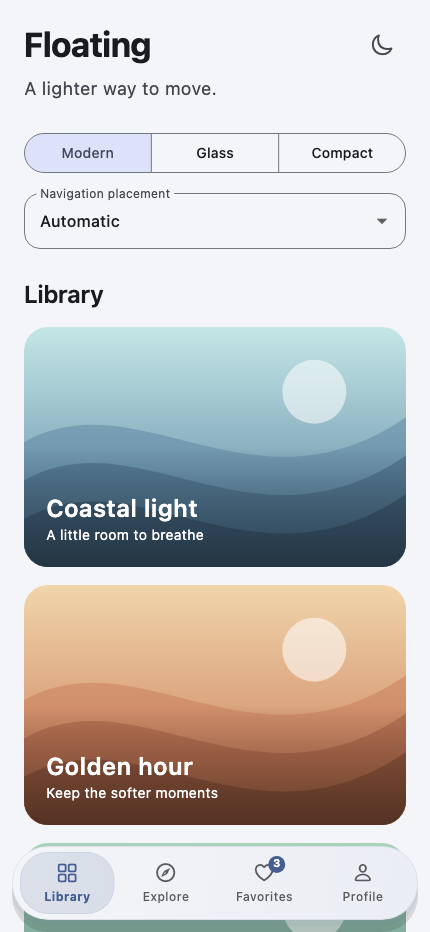
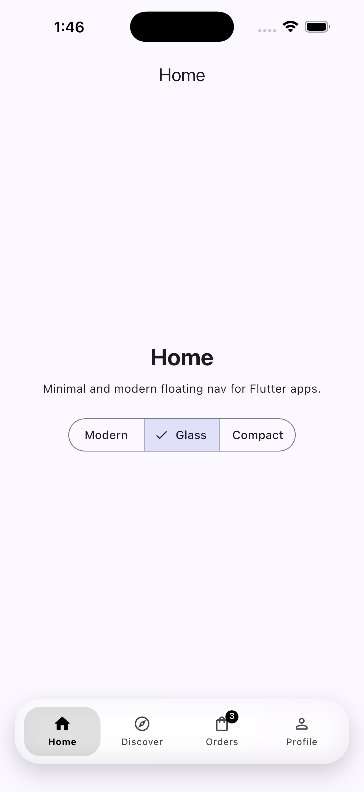
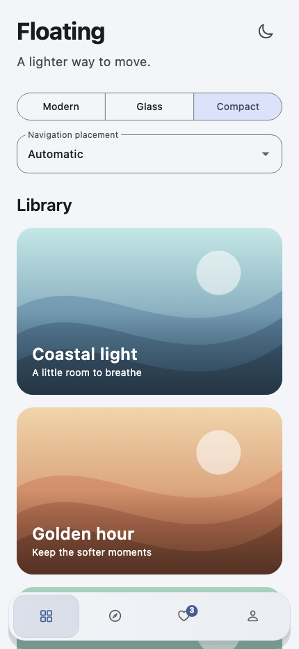
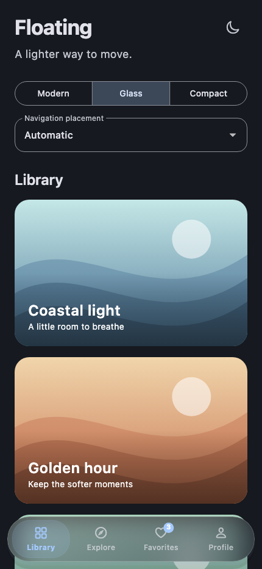
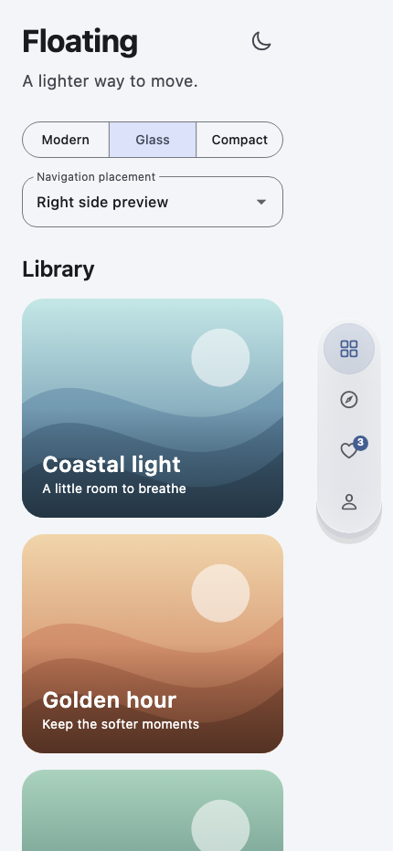
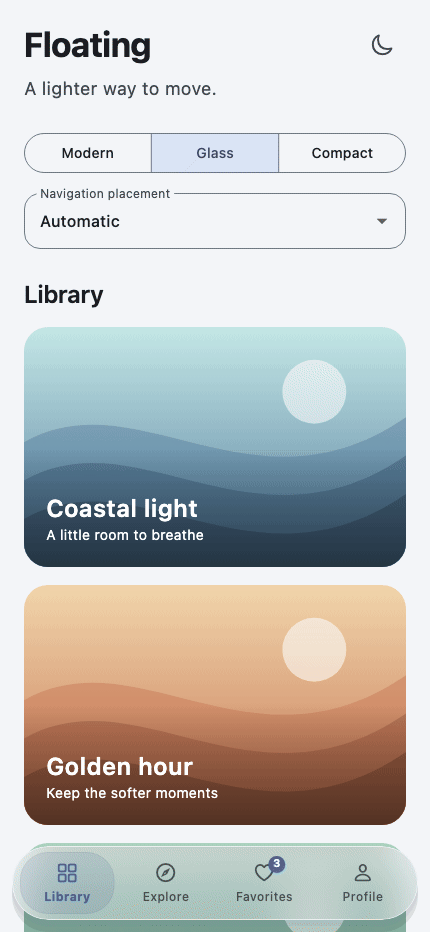

# floating_modern_navbar

[](https://pub.dev/packages/floating_modern_navbar)
[](LICENSE)

Floating navigation for Flutter with Modern, Glass, and Compact styles.
Use a bottom bar on everyday phones, or let the adaptive page host position a
side rail in iPhone Duo's native bar region.

- Apple-inspired glass with light/dark appearance, blur, and rounded selections.
- **iPhone Duo support:** automatic navigation in the native sidebar region, with bottom navigation on ordinary phones.
- Manual bottom, left, and right placement overrides.
- Active icons, labels, tooltips, unread badges, and tap feedback.
- Configurable colors, shapes, spacing, shadows, and animations.
- Optional bottom-bar collapse and transparency while scrolling.

## Start here

| I want to… | Read |
| --- | --- |
| Add navigation now | [Quick start](#quick-start) |
| Set up automatic Duo placement | [Duo setup and safe areas](doc/USAGE.md#3-enable-automatic-iphone-duo-placement) |
| Customize glass, icons, badges, or motion | [Usage guide](doc/USAGE.md) |
| Look up a property or its default | [Complete API reference](doc/API.md) |
| Try the interactive gallery | [Example app](example/README.md) |
| Fix an integration issue | [Troubleshooting](doc/USAGE.md#troubleshooting) |

## Installation

Install version **0.2.0 or newer** for iPhone Duo support:

```sh
flutter pub add floating_modern_navbar:^0.2.0
```

Or add it to your app's `pubspec.yaml`:

```yaml
dependencies:
  floating_modern_navbar: ^0.2.0
```

Then run `flutter pub get`. Use a Flutter SDK with Dart 3.10.4 or newer within
the Dart 3 series, as required by this package's SDK constraint. Android and
iOS are the declared supported platforms. Automatic Duo placement additionally
requires building with the iOS 27.1+ SDK and running on a supported iOS 27.1+
configuration. Other configurations fall back to bottom navigation.

## iPhone Duo support

**Version 0.2.0 supports adaptive iPhone Duo side navigation.** Use
`FloatingAdaptiveNavScaffold`; automatic placement is enabled by default.
The package reads iOS's bar edge and layout region, places navigation in the
side region, and avoids counting the side safe area twice. It returns to bottom
navigation when the current pose calls for it.

Build with the **iOS 27.1+ SDK** and run on a supported **iOS 27.1+** configuration.
Older SDKs/runtimes and Android keep bottom navigation. Native plugin changes
require a full rebuild. See [Duo setup](doc/USAGE.md#3-enable-automatic-iphone-duo-placement).

## Quick start

Copy this complete example into your app's `lib/main.dart`. It connects three
tabs to pages, keeps those pages mounted, and enables automatic placement.

```dart
import 'package:flutter/material.dart';
import 'package:floating_modern_navbar/floating_modern_navbar.dart';

void main() => runApp(const MaterialApp(home: NavigationDemo()));

class NavigationDemo extends StatefulWidget {
  const NavigationDemo({super.key});

  @override
  State<NavigationDemo> createState() => _NavigationDemoState();
}

class _NavigationDemoState extends State<NavigationDemo> {
  int selectedIndex = 0;

  static const items = [
    FloatingNavBarItem(
      icon: Icons.home_outlined,
      activeIcon: Icons.home_rounded,
      label: 'Home',
    ),
    FloatingNavBarItem(icon: Icons.search, label: 'Search'),
    FloatingNavBarItem(
      icon: Icons.inbox_outlined,
      activeIcon: Icons.inbox,
      label: 'Inbox',
      tooltip: 'Open your inbox',
      badgeCount: 3,
    ),
  ];

  @override
  Widget build(BuildContext context) {
    return FloatingAdaptiveNavScaffold(
      items: items,
      currentIndex: selectedIndex,
      onTap: (index) => setState(() => selectedIndex = index),
      variant: FloatingNavBarVariant.glassmorphism,
      placement: FloatingNavBarPlacement.automatic,
      body: SafeArea(
        child: IndexedStack(
          index: selectedIndex,
          children: const [
            Center(child: Text('Home')),
            Center(child: Text('Search')),
            Center(child: Text('Inbox')),
          ],
        ),
      ),
    );
  }
}
```

`currentIndex` selects a tab; `onTap` updates your app's state. The package does
not change routes for you. Here, `IndexedStack` displays the selected page and
keeps the others mounted.

Use `FloatingAdaptiveNavScaffold` as the page host, with `SafeArea` inside its
`body`. It already creates a Scaffold and accounts for the side bar's space.
There is no need to wrap the whole host in another `SafeArea`.

## Which widget should I use?

| Component | Purpose |
| --- | --- |
| `FloatingAdaptiveNavScaffold` | Easiest automatic bottom/side layout. Exposes content, destinations, selection, preset, placement, and page background. |
| `FloatingModernNavBar` | Standalone bar with all styling and animation controls. Add it to your own Scaffold or layout. |
| `FloatingNavBarScrollContainer` | Overlays a bottom bar and supplies collapse/fade progress from scrolling. |
| `FloatingNavBarItem` | Describes a destination's icons, label, tooltip, and badge. |

The adaptive host defaults to Glass; the standalone bar defaults to Modern.
The scroll wrapper is a separate bottom-bar integration and does not add
scroll collapse to the adaptive scaffold.

## Ready-to-run recipes

- [Automatic navigation](doc/examples/adaptive.dart): bottom/side placement and persistent tab pages.
- [Styled glass bottom bar](doc/examples/styled_bottom.dart): a visible backdrop, custom colors, sizes, animation, and badges.
- [Scroll-aware bottom bar](doc/examples/scroll.dart): shrink on scroll and optionally fade at the end.

From `example/`, run a recipe with `flutter run -t ../doc/examples/adaptive.dart`
(or substitute the other filename). To explore all presets interactively:

```sh
cd example
flutter pub get
flutter run
```

## Previews

Captured from the current Flutter widgets at the same phone size.

### Variants

| Modern | Glass | Compact |
| --- | --- | --- |
|  |  |  |

### Glass appearance and side placement

| Light | Dark | Side preview |
| --- | --- | --- |
|  |  |  |

The side image uses the manual preview setting; it is not a capture from Duo hardware.

### Scroll collapse

| Collapse and expand | Fade at scroll end |
| --- | --- |
|  |  |

These animations use `FloatingNavBarScrollContainer` with the example gallery.
They show scrolling down to the end and back up. The adaptive scaffold itself
does not add scroll-collapse behavior.

See [preview regeneration instructions](example/README.md#regenerate-previews).


## A few useful details

Glass is rendered in Flutter and approximates Apple's appearance; it is not
UIKit's native Liquid Glass material. Let content extend behind the bar for
visible blur. The adaptive host does this for bottom placement; set
`extendBody: true` when using your own Scaffold.

Automatic Duo placement follows iOS's current bar edge and layout region, not
a screen-width guess. The sidebar spacing fix has been confirmed in the Duo
simulator by the project maintainer. See [setup and safe-area guidance](doc/USAGE.md#3-enable-automatic-iphone-duo-placement)
for build requirements and integration details.

Every constructor option, preset override, and current limitation is listed in
the [API reference](doc/API.md). For step-by-step integration and common fixes,
continue with the [usage guide](doc/USAGE.md).
