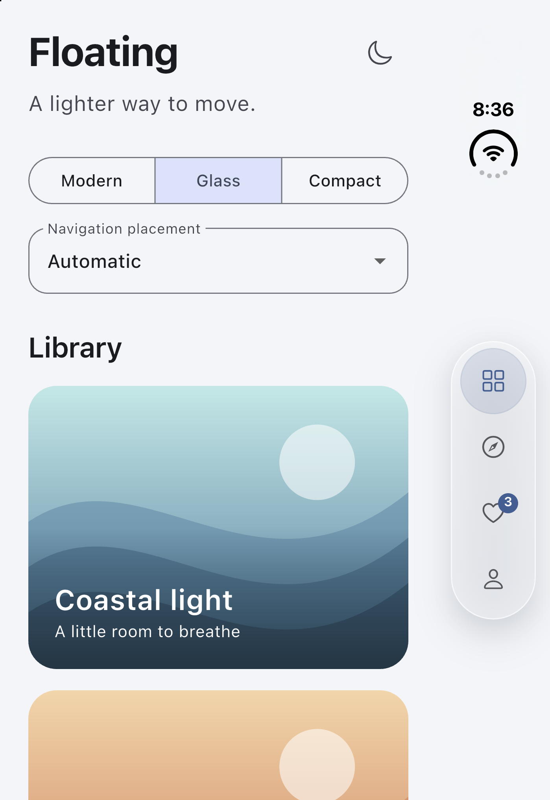
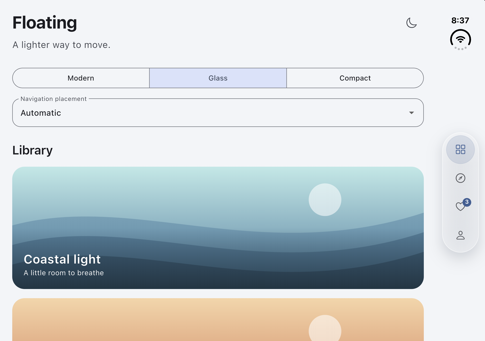

# Floating navigation example

A gallery demo of the package's Modern, Glass, and Compact styles, with
light/dark appearance and automatic or manual bottom/side placement.

```sh
cd example
flutter pub get
flutter run
```

Use the style selector, moon button, and placement menu to explore the presets.
Tap destinations to change the selected section. The example starts in Glass
with automatic placement.

For integration into your own app, start with the [quick start](../README.md#quick-start),
then read the [usage guide](../doc/USAGE.md) or [full API reference](../doc/API.md).
Three smaller, complete apps are also available:

```sh
# Run from example/ after flutter pub get.
flutter run -t ../doc/examples/adaptive.dart
flutter run -t ../doc/examples/styled_bottom.dart
flutter run -t ../doc/examples/scroll.dart
```

The adaptive example handles placement and tab state; the styled example exposes
standalone glass customization; the scroll example shows collapse and fading.
Automatic Duo placement requires the iOS 27.1 SDK and a supported runtime;
manual side previews work without Duo hardware.

## Previews

Actual iPhone Duo simulator captures with automatic placement:

| Folded | Unfolded landscape |
| --- | --- |
|  |  |

Style previews rendered by Flutter:

| Modern | Glass | Compact |
| --- | --- | --- |
|  |  |  |

| Dark glass | Side placement |
| --- | --- |
|  |  |

| Scroll collapse | Fade at scroll end |
| --- | --- |
|  |  |

The GIFs reuse the gallery in a separate `FloatingNavBarScrollContainer` capture
harness. The interactive example uses `FloatingAdaptiveNavScaffold`.

## Regenerate previews

From this directory, run:

```sh
flutter test tool/generate_previews.dart
```

This replaces the six rendered PNGs and both GIFs in `../assets/previews/` using actual
Flutter rendering at 430 × 932 logical pixels. The capture loads real text and
icon fonts, checks for layout exceptions, and verifies collapse/transparency
at the end of each recorded scroll. Temporary animation frames are cleaned up.

The two `iphone-duo-*.png` files are actual simulator captures, supplied by the
maintainer. The generator does not overwrite them.

Requirements:

- Flutter and the example's resolved dependencies.
- `ffmpeg` on `PATH` to encode the looping GIFs.
- A local text font. On macOS the script uses `/System/Library/Fonts/SFNS.ttf`.
  On another host, set `PREVIEW_FONT` to a local `.ttf` file. Font choice may
  change text metrics. Fonts are loaded for capture only and are not bundled.

The side preview is an explicit layout override, not proof of Duo hardware
validation. All README image links point to repository assets so previews follow
the checked-out version.
